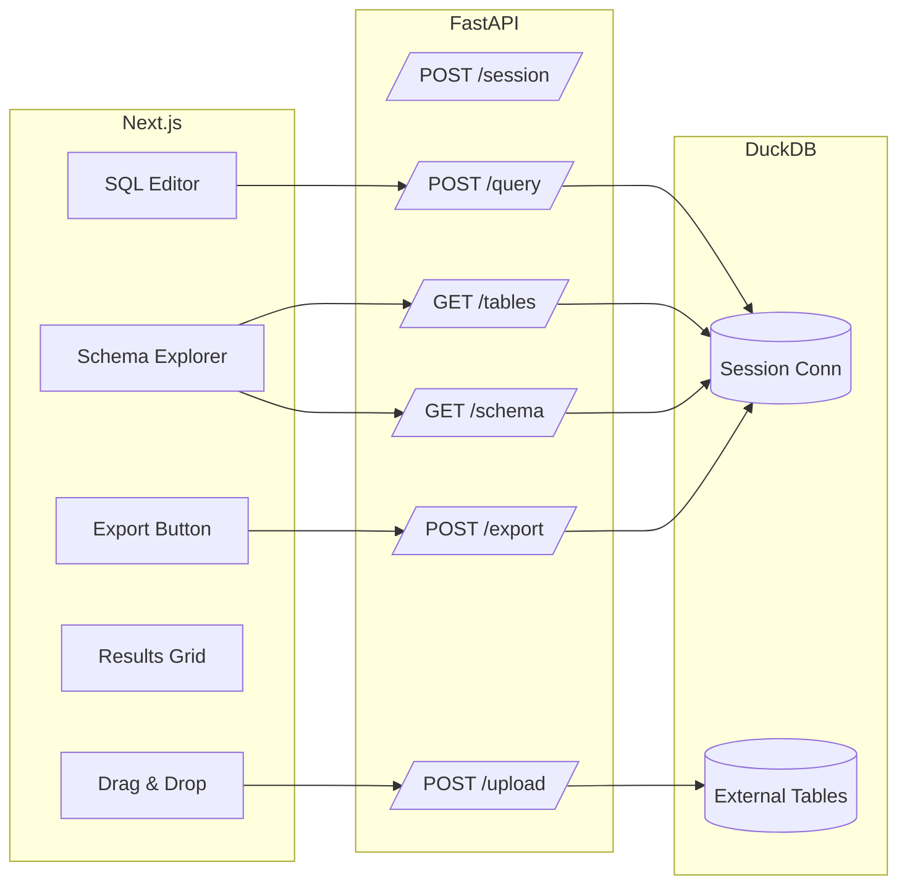

# LiteHouse — Product Requirements Document (PRD)

## 1. Product Summary

**LiteHouse** is a lightweight, developer-friendly SQL workbench for file-based data. Users can drag in CSV, Parquet, JSON, or SQLite files and query them instantly without imports, using a Next.js UI and a Python FastAPI backend powered by DuckDB.

## 2. Goals & Objectives

- **Goal:** Enable rapid, local exploration and querying of file-based datasets with a modern UI.
- **Primary Objective:** Deliver a usable MVP in 3 days.
- **Secondary Objective:** Provide a foundation for future enhancements like charts, profiling, and AI-assisted queries.

## 3. Target Audience

- Data scientists & analysts who want to quickly explore data without full ETL.
- Developers who debug or prototype against local datasets.
- Students & learners practicing SQL.

## 4. Core Features (MVP)

1. Drag-and-drop upload for CSV, Parquet, JSON, SQLite.
2. Automatic table registration in DuckDB without data import.
3. SQL editor with run button.
4. Paginated results table with column metadata.
5. Schema explorer.
6. Export query results to CSV.

## 5. Non-Goals (MVP)

- No persistent cloud storage.
- No multi-user collaboration.
- No authentication.

## 6. Requirements

### Functional Requirements

- **FR1:** User can start a session and receive a unique `session_id`.
- **FR2:** User can upload supported files; backend registers them as tables.
- **FR3:** User can retrieve list of tables and their schemas.
- **FR4:** User can execute read-only SQL queries with pagination.
- **FR5:** User can export query results in CSV format.
- **FR6:** SQL execution has a timeout (default: 30 seconds).

### Non-Functional Requirements

- **NFR1:** Backend must reject dangerous SQL commands (`INSTALL`, `LOAD`, etc.).
- **NFR2:** System should handle datasets up to 1GB in size locally.
- **NFR3:** Query latency should be < 2 seconds for datasets up to 100MB.
- **NFR4:** Frontend and backend should run in Docker for easy setup.

## 7. User Stories

1. **As a data analyst**, I want to drag a CSV into LiteHouse and query it immediately so I can quickly explore my data.
2. **As a developer**, I want to join data from a CSV and a SQLite table so I can validate transformations.
3. **As a student**, I want to see example queries so I can learn SQL syntax.

## 8. Success Metrics

- MVP deployed locally and tested with 3+ file formats.
- Queries return first page of results in < 2 seconds for 100MB files.
- Zero unhandled exceptions during normal operations.

## 9. Technical Architecture

- **Frontend:** Next.js with React Dropzone, Monaco Editor, TanStack Table.
- **Backend:** FastAPI with DuckDB and PyArrow.
- **Data Storage:** Temporary per-session workspace.
- **Execution:** One DuckDB connection per session.
- **Security:** Read-only queries, token validation, timeouts.

## 10. Risks & Mitigations

- **Large file handling**: Use DuckDB’s lazy scan.
- **Security**: Strict SQL validation and read-only mode.
- **Performance**: Pagination and query timeouts.

## 11. Milestones

**Day 1:** CSV vertical slice (upload → query → results).  
**Day 2:** Multi-format support, schema explorer, SQL validation.  
**Day 3:** Export, UI polish, docker-compose, sample data.

## 12. Future Enhancements

- Charts and data profiling.
- AI query assistant.
- Save/load sessions.
- WASM-based in-browser execution.
