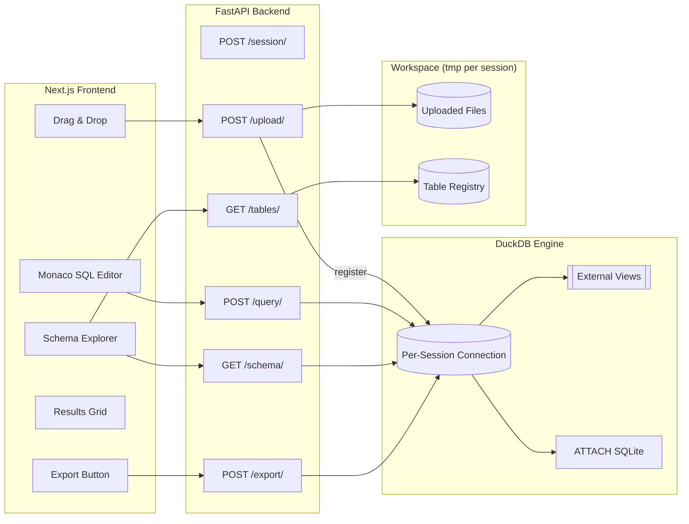
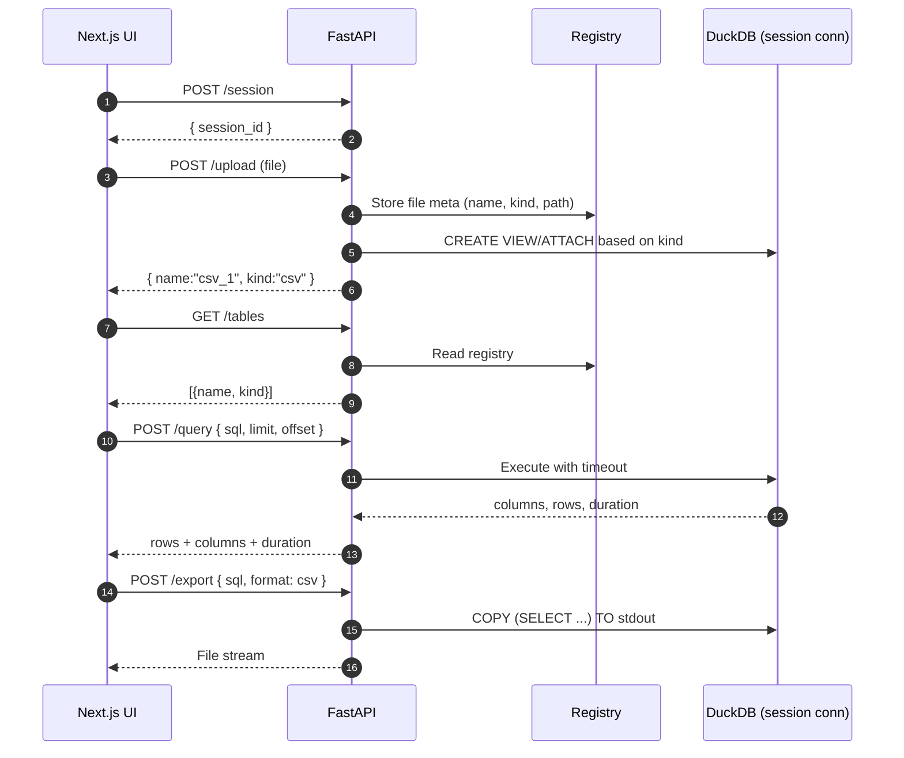
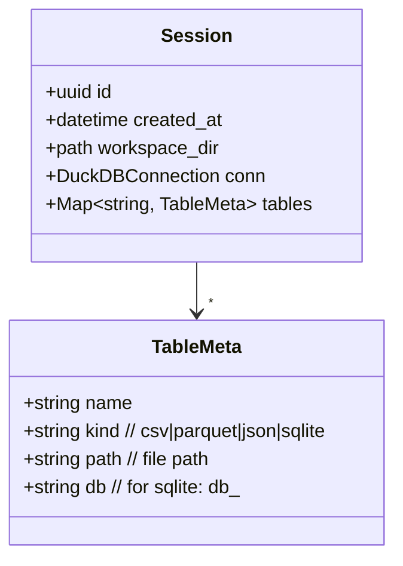
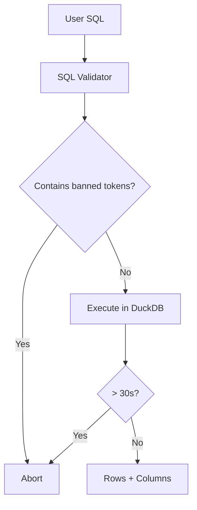

# LiteHouse—System Design

A lightweight, developer-friendly SQL workbench for **file-based data**. Drag in CSV, Parquet, JSON, or SQLite and query them instantly—no imports—via a Next.js UI and a Python FastAPI backend powered by DuckDB.

---

## 1) MVP Scope (3 Days)

**By Day 3, you can:**

- Drag & drop CSV/Parquet/JSON/SQLite
- Auto-register as queryable tables
- Edit SQL → Run → Paginated results
- Browse schema in a sidebar
- Export results (CSV)
- Local development only

---

## 2) High-Level Architecture



**Key ideas**

- Each user session gets a **temp workspace** and a **DuckDB connection**.
- Uploaded files are **registered as external tables/views** (no import):
  - `read_csv_auto(path)`, `read_parquet(path)`, `read_json_auto(path)`
  - SQLite is **attached**: `ATTACH 'path' AS db_<n> (READ_ONLY)`
- SQL runs with limits/timeouts and is read‑only by default.

---

## 3) Query Lifecycle (Sequence)



---

## 4) Minimal API Contract

```http
POST /session
→ 200 { "session_id": "uuid" }

POST /upload (multipart: file)
Headers: X-Session-Id
→ 200 { "name":"csv_1", "kind":"csv" }

GET /tables
Headers: X-Session-Id
→ 200 [ { "name":"csv_1","kind":"csv" }, { "name":"db_1.main.users","kind":"sqlite" } ]

GET /schema?table=csv_1
Headers: X-Session-Id
→ 200 { "table":"csv_1", "columns":[{"name":"id","type":"INTEGER"}, ...] }

POST /query
Headers: X-Session-Id
Body: { "sql":"SELECT ...", "limit":100, "offset":0 }
→ 200 { "columns":[{"name":"id","type":"INTEGER"}], "rows":[[1,"a"],...], "total_est":12345, "duration_ms":42 }

POST /export
Headers: X-Session-Id
Body: { "sql":"SELECT ...", "format":"csv" }
→ 200 (file stream)
```

---

## 5) Data Model & Session Handling



**Notes**

- `workspace_dir` is auto‑cleaned on session expiry (e.g., idle > 2h).
- One DuckDB connection per session to keep catalog/view state.

---

## 6) Security & Guardrails

- Read‑only by default; reject dangerous tokens (`INSTALL`, `LOAD`, `COPY FROM http`, `ATTACH http`).
- Per‑query timeout (e.g., 30s) via `asyncio.wait_for`.
- Cap threads/memory via DuckDB settings; disable network I/O.
- FastAPI CORS: allow `http://localhost:*` in dev only.
- Sanitize filenames; store in per‑session temp dir.



---

## 7) Performance Tactics

- Pushdown filters/projections; default `LIMIT 100`.
- Lazy scan; Arrow interchange for fast IO.
- For huge files, optional explicit `COUNT(*)` behind a separate action.
- Paginate with `LIMIT/OFFSET`; server returns `total_est` when cheap, else `null`.

---

## 8) 3‑Day Build Plan

### Day 1 — Vertical Slice (CSV only)

**Backend**

- FastAPI skeleton: `/session`, `/upload`(CSV), `/query`, `/tables`, `/schema`.
- Per‑session workspace & DuckDB connection; CSV registered via `read_csv_auto`.

**Frontend**

- Next.js app: dropzone, Monaco editor, results grid (TanStack Table).
- On load: `POST /session`; store `session_id` in localStorage.

**Acceptance**

- Drop a 50MB CSV → `SELECT * FROM file LIMIT 100;` shows rows.

### Day 2 — Multi‑format + SQLite + UX

**Backend**

- Add Parquet (`read_parquet`), JSON (`read_json_auto`), SQLite (`ATTACH ... READ_ONLY`).
- `/tables` returns `{name, kind, db?}`; `/query` returns `duration_ms` & column types.
- SQL validation + per‑request timeout.

**Frontend**

- Sidebar schema explorer (group by source).
- Query history (local, last 20); quick example inserts.

**Acceptance**

- Join CSV + Parquet; query attached SQLite table.

### Day 3 — Export, Polish, Docs

**Backend**

- `/export` CSV; structured errors `{message, hint, position?}`.

**Frontend**

- Export button; status bar (row count, duration, truncation notice).
- Shortcuts: ⌘/Ctrl+Enter (run), ⌘/Ctrl+S (save snippet locally).

**DX**

- `docker-compose.yml` (Next.js + FastAPI); `.env.local` for API URL.
- `samples/` data; README with quickstart and screenshots.

**Acceptance**

- Demo: drop files → explore → run join → export CSV.

---

## 9) Future Enhancements

- Charts (auto‑detect aggregations); simple profile stats.
- AI helper (query templates; optional LLM later).
- Save sessions; export catalog to a `.duckdb` database.
- WASM/DuckDB-in-browser fallback for offline/local‑only mode.

---

## 10) Updated 300‑char Description

**LiteHouse** is a sleek SQL workbench for file-based data. Drag in CSV, Parquet, JSON, or SQLite and start querying instantly—no imports needed. Powered by DuckDB with a Next.js UI and Python backend. Inspect schemas, join across files, paginate results, and export with a click.
